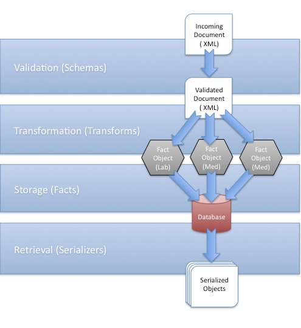

Data Pipeline
==============

Introduction
------------

The Indivo Data Pipeline is the set of processes that take input data as it enters Indivo, extract and store clinical 
datapoints (:term:`Facts <fact>`), and make those datapoints available as output via the :doc:`API <api>`. As of version
1.1 of Indivo X, every component of the pipeline is substitutable: you can add new formats for input data, new ways to
store the data, and new methods to output them.

Let's start with some vocabulary:

.. glossary::

   Schema
     A description of a format for data, which can also be used to validate that data. For example, our 
     :doc:`Medication Schema <schemas/medication-schema>` defines the format of an Indivo Medication document, and can be 
     used to determine whether an XML document is a valid Indivo Medication. In Indivo, we use schemas to define
     the formats in which we accept data via the API, and validate that data as it comes in. Right now, schemas
     can only take the form of `XSDs <http://www.w3.org/XML/Schema>`_, since we accept input data only in XML
     form, but in the future this might change. More on Indivo schemas :doc:`here <schemas/index>`.

   Document
     A collection of data, formatted according to a :term:`Schema`. When you use :ref:`our API <api-writing-documents>`
     to add data to Indivo, the data you send to Indivo constitutes one document.

   Transform
     A tool that takes as input some data which validates against a schema, and outputs it in a format consistent
     with Indivo's :term:`Data Models <data model>`. We currently accept two types of transforms: 
     `XSLTs <http://www.w3.org/TR/xslt>`_ and :ref:`Python code <python-transforms>`. We also understand 
     :ref:`several output formats <transform-output-types>` for the data after it has been transformed. More on
     transforms in Indivo :doc:`here <transform>`.

   Data Model
     A definition of the format in which processed data is stored in Indivo's database. Each 'data model'
     corresponds to a type of clinical information. For example, our 
     :doc:`Medication Data Model <data-models/medication>` describes how we represent a processed medication
     in the database. It is *NOT* the same as our :doc:`Medication Schema <schemas/medication-schema>`, which describes 
     the XML form in which we accept data about medications. We currently accept 
     :ref:`two types of data model definitions <data-model-definition-types>`. More on Indivo Data Models
     :doc:`here <data-models/index>`.

   Fact
     A single datapoint: an instance of a data model. For example, one Medication is a Fact, as is one Problem, etc. The
     medication fact is an object whose format is defined by the :doc:`Medication Data Model <data-models/medication>`.
     When you take input data in the form of an XML :term:`Document` and run it through a :term:`Transform`, you arrive
     at a Fact object that can be stored in the database.

   Serialization
     The process of taking a :term:`Fact object <Fact>` and converting it to an output format, suitable for returning in
     response to an API call. For example, our current :ref:`Reporting API <processed-reports>` outputs Fact objects
     serialized to XML or JSON.

The Pipeline
------------

   
   The Indivo Data Pipeline, Visualized

As you may have surmised from the above definitions, the data pipeline in Indivo is actually pretty simple, and consists
of five steps:

#. **Identification.** An incoming document is examined, and its type determined (right now, since data comes only in XML
   documents, a document's type can be uniquely constructed from it's root nodename and namespace, i.e. 
   ``http://indivo.org/vocab/xml/documents#Allergy``).

#. **Validation.** The identified document is matched against its :term:`schema`. If it is invalid, the pipeline terminates,
   and an error is thrown.

#. **Transformation.** The validated document is then processed using its :term:`transform`. If the output matches one of 
   the valid :ref:`transform output formats <transform-output-types>`, it is converted into one or more 
   :term:`Fact objects <Fact>`, ready for storage.

#. **Storage.** The processed Facts are written to the database.

#. **Retrieval.** When an app makes an API call using the :ref:`Reporting API <processed-reports>`, the database is queried
   for matching Facts. Those facts are then :term:`serialized <Serialization>` into the required output format (i.e., 
   XML or JSON) and returned to the app.

With the new data pipeline, :term:`Schemas <Schema>`, :term:`Transforms <Transform>`, and :term:`Data Models <Data Model>`
are all substitutable: you can add and replace them at will. 

Notice that there is not a one-to-one relationship between incoming documents and processed fact objects. This allows for 
Indivo to accept schemas like a CCR, which contains many facts. A parsed CCR document might end up outputting many
Problem, Medication, Allergy, Lab, or other facts, even though there was only one input document.

Conversely, there is not one document type associated with producing one type of fact object. This allows Indivo to accept
the same type of data in many formats. For example, you could get a medication fact from our standard medication document,
but you could also get a medication fact from a CCR.

The data pipeline is activated whenever new data is added to Indivo using document creation API calls, and whenever data
is retrieved from Indivo using the reporting API calls. The following calls add new documents to Indivo, and therefore
feed data into the pipeline:

* :http:post:`/records/{RECORD_ID}/documents/`
* :http:put:`/records/{RECORD_ID}/documents/external/{APP_ID}/{EXTERNAL_ID}`
* :http:post:`/records/{RECORD_ID}/documents/{DOCUMENT_ID}/replace`
* :http:put:`/records/{RECORD_ID}/documents/{DOCUMENT_ID}/replace/external/{APP_ID}/{EXTERNAL_ID}`
* :http:post:`/records/{RECORD_ID}/documents/{DOCUMENT_ID}/rels/{REL_TYPE}/`
* :http:put:`/records/{RECORD_ID}/documents/{DOCUMENT_ID}/rels/{REL_TYPE}/external/{APP_ID}/{EXTERNAL_ID}`
* :http:post:`/accounts/{ACCOUNT_ID}/inbox/{MESSAGE_ID}/attachments/{ATTACHMENT_NUM}/accept`

All of the :ref:`reporting <processed-reports>` calls retrieve collections of processed Fact objects from Indivo, and 
thus rely on the tail end of the processing pipeline.

Learning More
-------------

.. seealso::

   | More information on the components of the data pipeline can be found here:
   
   * :doc:`schemas/index`
   * :doc:`transform`
   * :doc:`data-models/index`

   More information on customizing the data pipeline can be found here:
   
   * :ref:`add-schema`
   * :ref:`add-transform`
   * :ref:`add-data-model`
